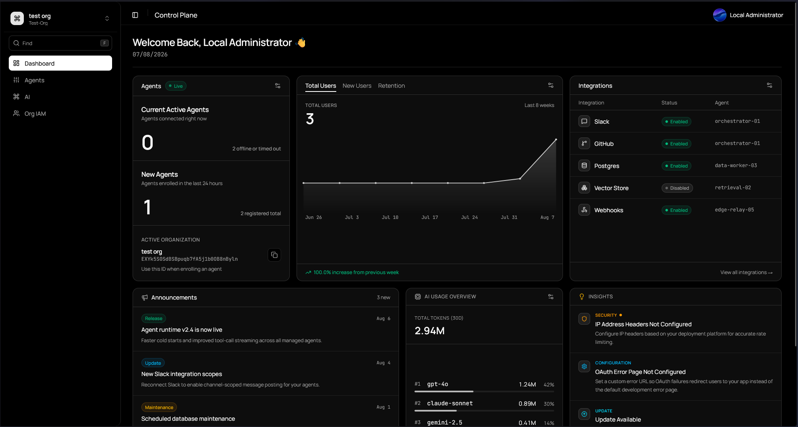

# 🚀 Fortmont Control Plane

Welcome to **Fortmont Control Plane (FCP)**, the next generation of the Fortmont platform.

Fortmont Control Plane is a complete redesign of the original Fortmont API, built with scalability, security, and long-term maintainability in mind. Rather than simply acting as an API, FCP serves as the central platform responsible for authentication, agent management, infrastructure orchestration, and communication between Fortmont applications.

As the platform evolves, FCP will provide secure registration and management of Fortmont Agents, enabling real-time communication with customer infrastructure. Agents will be capable of collecting system metrics, executing infrastructure tasks, and securely interacting with services such as virtualization platforms, networking equipment, and other supported integrations.

---

# 🚧 Project Status

Fortmont Control Plane is currently in **early development**.

Core platform functionality is actively being developed, and many features are still incomplete or subject to change. During the coming weeks, development will focus on:

* 🏗️ Building the core platform architecture
* 🔐 Implementing secure authentication and authorization
* 🤖 Developing the Fortmont Agent communication protocol
* 🖥️ Expanding infrastructure management capabilities
* ✨ Improving stability, security, and overall developer experience

Until an initial stable release is published, there is no available instance to use  

Current dashboard view

---

# ☁️ The Fortmont Platform

Fortmont Control Plane is only one part of the new Fortmont ecosystem.

The platform is being redesigned around two primary applications:

* **🛡️ Fortmont Control Plane** – The backend platform responsible for authentication, APIs, agent management, and infrastructure communication.
* **☁️ Fortmont Cloud** – The customer-facing experience, providing dashboards, infrastructure management, storage, monitoring, and future productivity applications.

This separation allows the platform to support multiple clients—including web, desktop, mobile, CLI, and the Fortmont Agent—all through a single, consistent API.

---

# 📚 Learn More

A dedicated Fortmont website is currently under development and will include:

* 📖 Product documentation
* 🚀 Getting started guides
* 🔌 API documentation
* 📢 Feature announcements
* 💬 Community resources

Until then, if you have questions or would like to learn more about the project, feel free to open a GitHub issue using the **`[info]`** prefix.

---

# 🌱 A New Direction

Earlier Fortmont projects, including **Fortmont Home** and the original **Fortmont API**, were primarily designed around personal homelab management and infrastructure integrations.

Fortmont Control Plane represents a complete architectural redesign.

The goal is to build a modern platform that is:

* ☁️ Cloud-first
* 🔌 API-first
* 👨‍💻 Developer-friendly
* 🧩 Modular and scalable
* 🌍 Designed for both homelab enthusiasts and professional environments

This redesign lays the foundation for future capabilities while making it significantly easier to expand the platform over time.

---

# ⚡ Getting Started

A hosted preview of Fortmont Control Plane and Fortmont Cloud is planned once the platform reaches a stable state.

The control plane will be available when released at (Fortmont Contrl Plane)[https://admin.cloud.fortmont.me] and Fortmont Cloud will be at (Fortmont Cloud)[https://cloud.fortmont.me]

No local development support is planned for this project, as this project is open source but cloud hosted. If you would like this project to have local dev support, please send a email to support@fortmont.me with your inquiry 

---

# ❤️ A Personal Note

Fortmont began as a personal learning project driven by curiosity and a passion for infrastructure, systems administration, and software development.

Over time, it has grown into something much bigger than originally imagined.

Whether Fortmont becomes a widely used platform or simply remains an incredible learning experience, every version represents another opportunity to improve, experiment, and build something meaningful.

Thank you for taking the time to explore the project—I hope you enjoy following its journey as much as I've enjoyed building it.

---

# 🤖 AI Assistance

Fortmont is developed with the assistance of modern AI tools.

AI is used to accelerate development, assist with implementation ideas, improve documentation, and help prototype user interfaces. However, all significant architectural decisions, code reviews, testing, debugging, and production-ready implementations are performed and verified by the developer before being incorporated into the project.
